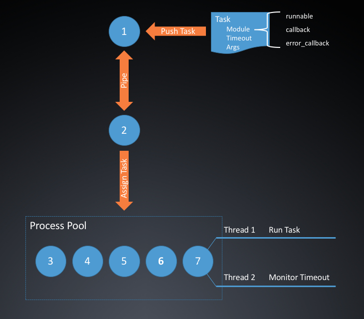

# Common Multiprocess Module

## Usage

### Example

```python
import os
import random
import time

from multiprocess import MultiProcess, InfoTask, Model


class Demo(Model):
    """
    Task Model
    """
    
    def runnable(self, *args):
        """
        main function will be executed by Worker
        :param args:
        :return:
        """
        print("run pid", os.getpid(), end=", ")
        print("get first args", args[0], end=", ")
        print("get second args", args[1])
        time.sleep(random.uniform(0, 2))
        return args[0], args[1]

    def callback(self, result):
        """
        callback function when success
        PLEASE NOTE: don't raise any Exception here, otherwise the process cannot exit normally
        :param result:
        :return:
        """
        print("pid", os.getpid(), "result", result[0], result[1])

    def error_callback(self, error):
        """
        callback function when fail
        PLEASE NOTE: don't raise any Exception here, otherwise the process cannot exit normally
        :param error:
        :return:
        """
        print("error_callback ", os.getpid(), error)


if __name__ == '__main__':
    # get a instance of CM module (specify the process-pool size)
    mp = MultiProcess(5)
    # start the CM module
    mp.start()
    for i in range(10):
        # create a Task instance (specify Task module, timeout, args)
        task = InfoTask("example.Demo", 1, {"test": i}, {"error": i})
        # push Task to process-pool
        mp.push(task)
    # no more new Task, wait exit
    mp.stop()

```


## 架构和设计

### 架构图



### 组成部分

#### 任务 *Task*

任务由父进程 *1* 通过管道推送给子进程 *2*，其中指定了任务模块所在命名空间 *module*（其中需要包含 *runnable，callback 和 error_callback*）三个方法，该任务的超时时间 &*Timeout*，和需要传递给 runnable 方法的参数 *Args*。


#### 父进程 *1*

即入口进程，与调用入口在统一进程，负责开启模块，在开启的同时，指定允许的进程池容量，父进程通过管道 *Pipe* 向子进程 *2* 推送任务消息。

#### 子进程 *2*

即调度进程，该进程维护了一个进程池 *Process Pool*，并通过管道 *Pipe* 和父进程 *1* 通讯，如果接收到了父进程 *1* 推送的任务，就分配给进程池 *Process Pool* 去执行，如果接收到退出消息，就等待进程池 *Process Pool* 中所有的进程退出后退出。

#### 进程池 *Process Pool*

其容量在父进程 *1* 开启模块时指定，采用带 callback 和 error_callback 的异步执行模式。

#### 任务进程 *3-7*

真正执行任务的 Worker 进程，采用 **双线程模式**，一个线程 *Thread1* 执行任务，另一个线程 *Thread2* 负责监控超时。如果任务成功，则返回结果并通知**子进程2**调用 callback 方法，如果超时或者出错，通知**子进程2**调用 error_callback 方法


### 设计思想

#### 线程 OR 进程

Python 的线程由于 Global Interpreter Lock（GIL，全局解释锁）的存在，使其实际上只能串行工作。另外，线程由于共享内存空间，会存在并行不安全性的问题。相反，进程是真正意义上的并发执行，且进程与进程之间是隔离的，不共享内存空间，因此一个进程崩溃并不会影响其他进程。

#### 由子进程维护进程池

为了实现解耦，不是由父进程直接维护进程池，而是新建一个子进程来维护，父进程只需要将消息通过管道推送给子进程即可。


#### 分配任务

子进程分配任务给进程池中的进程时，采用的是非阻塞的方式，即消息一旦推送给子进程，子进程就会立刻将任务分配给进程池（如果进程池有空闲的话）。在这种模式下，接收一个任务就会立即执行一个任务，能够提高效率。

#### 双线程监督超时

为了避免进程池中的进程出现假死而一直无法退出的情况，对于所有任务，当分配给它一个进程的时候，都会采用双线程的方式执行，一个线程用于执行任务，另一个线程用于监督是否超时，如果超时就会杀死任务并回调。

#### 带有正常和异常的回调

任务支持指定正常和异常回调函数，当函数正常退出时，会由子进程调用正常回调函数，当超时或者异常退出时，会由子进程调用异常回调函数。因此可以对任务的执行进行监控和后续操作。

### 注意

**一定要 catch 掉【正常回调】和【异常回调】抛出的异常**，否则父进程会无法退出。

